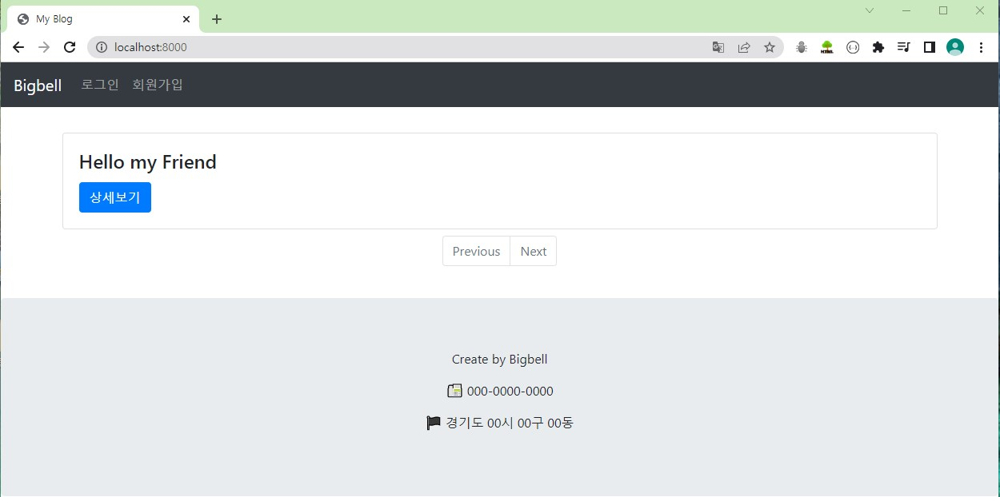
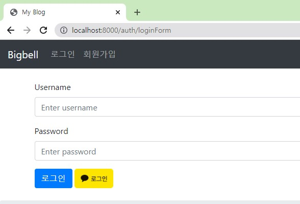

## 나만의 블로그 만들기

<hr/>

### 출처

- 메타코딩: [나만의 블로그 만들기](https://www.youtube.com/watch?v=6bhF5o4gAOs&list=PL93mKxaRDidECgjOBjPgI3Dyo8ka6Ilqm)

<hr/>

### 의존성

- Sring Boot DevTools
- Lombok
- Spring Data JPA
- Spring Security
- Spring Web
- oauth2-client
- MYSQL Driver

<hr/>

### yml 설정

```
server:
  port: 8000
  servlet:
    context-path: /
    encoding:
      charset: UTF-8
      enabled: true
      force: true
    
spring:
  mvc:
    view:
      prefix: /WEB-INF/views/
      suffix: .jsp
      
  datasource:
    driver-class-name: com.mysql.cj.jdbc.Driver
    url: jdbc:mysql://localhost:3306/blog?serverTimezone=Asia/Seoul
    username: cos
    password: cos1234
    
  jpa:
    open-in-view: true
    hibernate:
      ddl-auto: update
      naming:
        physical-strategy: org.hibernate.boot.model.naming.PhysicalNamingStrategyStandardImpl
      use-new-id-generator-mappings: false
#    show-sql: true
    properties:
      hibernate.format_sql: true

  jackson:
    serialization:
      fail-on-empty-beans: false
      
cos:
  key: cos1234
```

<br/>

<hr/>

### 기능

- 글쓰기, 글 삭제
- 댓글 쓰기, 삭제
- 로그인, 회원가입, 로그아웃 기능
- 카카오톡 OAuth를 통한 로그인 기능
- 회원정보 조회 및 수정
- 로그인 여부에 따른 기능 차이

<br/>

<hr/>

#### 로그인 이전 기능

#### :sunny: 홈페이지 화면



<br/>

#### :sunny: 로그인 화면

- 회원가입을 해 DB에 정보가 올라가야만 로그인할 수 있다.




- 카카오 로그인을 할 수 있다.
- 카카오 디벨로퍼 사이트에서 API를 활용해 사용자 정보를 불러옴
- 카카오 로그인 시 자동으로 회원가입이 진행된다.


<br/>

#### :sunny: 회원가입 화면

- 회원가입을 진행하면 DB에 사용자 정보를 저장


- 회원가입 시 **아이디 중복** 또는 **이메일 중복**이 있으면 회원가입 진행이 안된다.


<br/>

#### :sunny: 만약 글 조회하기를 누르면?

- 로그인을 하지 않으면 글을 조회할 수 없다.
- 자동으로 로그인 화면이 뜨도록 만들었다.


<br/>

<hr/>

#### 로그인 후 기능

<br/>

#### :sunny: 글쓰기 기능

- 로그인 시에만 글을 쓸 수 있다.
- 해당 글을 조회하면 글을 수정하는 것도 가능하다.


<br/>

#### :sunny: 글 조회 기능

- **페이징 쿼리**를 이용해 한 페이지 글을 3개씩만 조회 가능하도록 설정했다.
- Previous 버튼을 눌러 이전 게시물을 확인할 수 있다.
- Next 버튼을 눌러 다음 게시물을 확인할 수 있다.
- 만약 이전 게시물이나 다음 게시물이 없다면 버튼이 활성화되지 않는다.


<br/>

#### :sunny: 댓글 기능

- 로그인 시 댓글을 등록하고, 본인의 댓글이라면 삭제할 수 있다.


<br/>

#### :sunny: 회원정보 수정

- 비밀번호를 수정할 수 있다.


<br/>

<hr/>